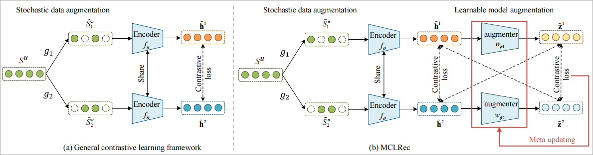

# MCLRec

This is our Pytorch implementation for the paper: "**[Meta-optimized Contrastive Learning for Sequential Recommendation](https://arxiv.org/pdf/2304.07763v1.pdf)**".
- [paper](https://arxiv.org/pdf/2304.07763v1.pdf)
- [video](https://www.bilibili.com/video/BV1sa4y1F7Jb/?spm_id_from=333.999.list.card_archive.click)
- [note](https://mp.weixin.qq.com/s/6_myRm30U2pz05ay9Kg4vQ)
## Environment  Requirement

* Pytorch>=1.7.0
* Python>=3.7 

## Model Overview



## Usage

Please run the following command to install all the requirements:  

```python
pip install -r requirements.txt
```

## Datasets Prepare

Please use the `data_process.py` under `dataset/` to  get the input dataset by running the following command :

```python
python data_process.py
```

## Evaluate Model

We provide the trained models on Amazon_Beauty, Amazon_Sports_and_Outdoors, and Yelp datasets in `./log/Checkpoint/<Data_name>`folder. You can directly evaluate the trained models on test set by running:

```
python run_seq.py --dataset=<Data_name> --do_eval
```

On Amazon_Beauty:

```python
python run_seq.py --dataset=Amazon_Beauty --do_eval
```

```
 INFO  test result: {'recall@5': 0.0581, 'recall@10': 0.0871, 'recall@20': 0.1243, 'recall@50': 0.1852, 'mrr@5': 0.0278, 'mrr@10': 0.0316, 'mrr@20': 0.0341, 'mrr@50': 0.036, 'ndcg@5': 0.0352, 'ndcg@10': 0.0446, 'ndcg@20': 0.0539, 'ndcg@50': 0.066, 'precision@5': 0.0116, 'precision@10': 0.0087, 'precision@20': 0.0062, 'precision@50': 0.0037}

```

On Amazon_Sports_and_Outdoors:

```python
python run_seq.py --dataset=Amazon_Sports_and_Outdoors --do_eval
```

```
INFO  test result: {'recall@5': 0.0328, 'recall@10': 0.0501, 'recall@20': 0.0734, 'recall@50': 0.1215, 'mrr@5': 0.0163, 'mrr@10': 0.0186, 'mrr@20': 0.0202, 'mrr@50': 0.0218, 'ndcg@5': 0.0204, 'ndcg@10': 0.026, 'ndcg@20': 0.0319, 'ndcg@50': 0.0414, 'precision@5': 0.0066, 'precision@10': 0.005, 'precision@20': 0.0037, 'precision@50': 0.0024}
```

On Yelp:

```python
python run_seq.py --dataset=Yelp --do_eval
```

```
INFO  test result: {'recall@5': 0.0454, 'recall@10': 0.0647, 'recall@20': 0.0941, 'recall@50': 0.1557, 'mrr@5': 0.0292, 'mrr@10': 0.0317, 'mrr@20': 0.0337, 'mrr@50': 0.0356, 'ndcg@5': 0.0332, 'ndcg@10': 0.0394, 'ndcg@20': 0.0467, 'ndcg@50': 0.0589, 'precision@5': 0.0091, 'precision@10': 0.0065, 'precision@20': 0.0047, 'precision@50': 0.0031}
```

## Train Model

Please train the model using the Python script `run_seq.py`.

​	You can run the following command to train the model on Yelp datasets:

```
python run_seq.py --dataset=Yelp --epochs=100 --use_rl=1 --joint=0 train_batch_size=256 --lmd=0.03 --beta=0.1 --sim='dot'
```

- or
You can cd `scripts` and run the following command to train the model on different dataset:
```
bash scrips/train_{dataset name}.sh

bash scripts/train_beauty.sh
bash scripts/train_ml-1m.sh
bash scripts/train_sports.sh
bash scripts/train_toys.sh
bash scripts/train_yelp.sh
```

## Overall Performances

N represents Normalized Discounted Cumulative Gain(NDCG) and H represents Hit Ratio (HR).

| Dataset | Metrc | BPR    | GRU4Rec | Caser  | SASRec | BERT4Rec | S3Rec  | CL4SRec | CoSeRec | LMA4Rec  | ICLRec | DuoRec   | SRMA     | MCLRec     | Improv. |
| ------- | ----- | ------ | ------- | ------ | ------ | -------- | ------ | ------- | ------- | -------- | ------ | -------- | -------- | ---------- | ------- |
| Sports  | H@5   | 0.0123 | 0.0162  | 0.0154 | 0.0214 | 0.0217   | 0.0121 | 0.0231  | 0.0290  | 0.0297   | 0.0290 | *0.0312* | 0.0299   | **0.0328** | 5.13%   |
| Sports  | H@20  | 0.0369 | 0.0421  | 0.0399 | 0.0500 | 0.0604   | 0.0344 | 0.0557  | 0.0636  | 0.0634   | 0.0646 | *0.0696* | 0.0649   | **0.0734** | 5.46%   |
| Sports  | N@5   | 0.0076 | 0.0103  | 0.0114 | 0.0144 | 0.0143   | 0.0084 | 0.0146  | 0.0196  | 0.0197   | 0.0191 | 0.0192   | *0.0199* | **0.0204** | 2.51%   |
| Sports  | N@20  | 0.0144 | 0.0186  | 0.0178 | 0.0224 | 0.0251   | 0.0146 | 0.0238  | 0.0293  | 0.0293   | 0.0291 | *0.0302* | 0.0297   | **0.0319** | 5.63%   |
| Beauty  | H@5   | 0.0178 | 0.0180  | 0.0251 | 0.0377 | 0.0360   | 0.0189 | 0.0401  | 0.0504  | 0.0511   | 0.0500 | *0.0559* | 0.0503   | **0.0581** | 3.94%   |
| Beauty  | H@20  | 0.0474 | 0.0427  | 0.0643 | 0.0894 | 0.0984   | 0.0487 | 0.0974  | 0.1034  | 0.1047   | 0.1058 | *0.1193* | 0.1025   | **0.1243** | 4.19%   |
| Beauty  | N@5   | 0.0109 | 0.0116  | 0.0145 | 0.0241 | 0.0216   | 0.0115 | 0.0268  | 0.0339  | *0.0342* | 0.0326 | 0.0340   | 0.0318   | **0.0352** | 2.92%   |
| Beauty  | N@20  | 0.0192 | 0.0186  | 0.0298 | 0.0386 | 0.0391   | 0.0198 | 0.0428  | 0.0487  | 0.0493   | 0.0483 | *0.0518* | 0.0474   | **0.0539** | 4.05%   |
| Yelp    | H@5   | 0.0127 | 0.0152  | 0.0142 | 0.0160 | 0.0196   | 0.0101 | 0.0227  | 0.0241  | 0.0233   | 0.0239 | *0.0429* | 0.0243   | **0.0454** | 5.83%   |
| Yelp    | H@20  | 0.0346 | 0.0371  | 0.0406 | 0.0443 | 0.0564   | 0.0314 | 0.0623  | 0.0649  | 0.0636   | 0.0659 | *0.0868* | 0.0646   | **0.0941** | 8.41%   |
| Yelp    | N@5   | 0.0082 | 0.0091  | 0.0080 | 0.0101 | 0.0121   | 0.0068 | 0.0143  | 0.0151  | 0.0147   | 0.0152 | *0.0324* | 0.0154   | **0.0332** | 2.47%   |
| Yelp    | N@20  | 0.0143 | 0.0145  | 0.0156 | 0.0179 | 0.0223   | 0.0127 | 0.0254  | 0.0263  | 0.0258   | 0.0270 | *0.0447* | 0.0266   | **0.0467** | 4.47%   |

## Future Work
- [x] Add MCL on Graph Recommendation
- [x] Building Augmenters Using Different Structures


## Acknowledgment

- Transformer and training pipeline are implemented based on [Recbole](https://github.com/RUCAIBox/RecBole). Thanks them for providing efficient implementation.

## Citation

```
@inproceedings{MCLRec,
  author       = {Xiuyuan Qin and
                  Huanhuan Yuan and
                  Pengpeng Zhao and
                  Junhua Fang and
                  Fuzhen Zhuang and
                  Guanfeng Liu and
                  Yanchi Liu and
                  Victor S. Sheng},
  title        = {Meta-optimized Contrastive Learning for Sequential Recommendation},
  booktitle    = {SIGIR},
  pages        = {89--98},
  year         = {2023},
}
```
- Please kindly cite our paper if this paper and the code are helpful. 
